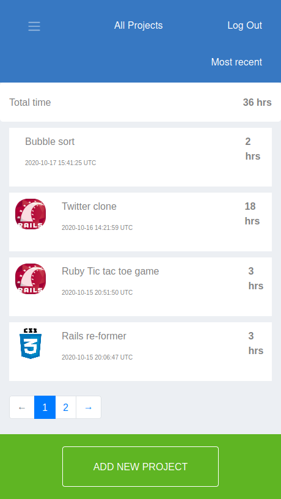

# Group My Projects

This is my Ruby on Rails capstone project. I build a mobile web app that can be used by students to group their projects. The app shows the project name, date created, and time taken to complete the project. The app also shows the groups available. a user can add a new group and a project as well. The summation of time spend on all the collective project by a user is also displayed.



## Built With
- Major languages: Ruby 2.7.0
- css: for form styling
- bootstrap 4
- frameworks: Rails 5.2.3
- technologies used: Rails tests

## Live Version
https://dry-tundra-15077.herokuapp.com/login

### Prerequisites
ruby version 2.7.0
rails version 5.2.3

### Setup
Run the the following commands in your terminal to setup the project in your local computer

1. Clone the project
```console
git clone git@github.com:oloomoses/group-my-projects.git
```
2. Go to the project folder
```console
cd group-my-projects
```
3. Check out the working branch
```console
git checkout features
```
4. run bundle to install all gems
```console
bundle install
```
5. Postgres db:create
```console
rails db:create
```
6. Update local database
```console
rails db:migrate
```

### Usage
Run the following command to run the project
```console
rails s
```  
6. Open your browser and type: http://localhost:3000/

## Validations
   #### users validations
      - user_name => Should be present 
      - user_name => Should be unique
      - name => Should be present
      - user_name_length => should be a maximum of 20
      - email => should be present && should be email format

   #### projects validations 
      - should belong to user
      - project name must be present
      - project time must be present
      - should belong to a group(optional)

   #### groups validation
      - should belong to user
      - name should be present
      - icon should be present
  
## Testing
  Run `bundle exec rspec`

## Author

👤 **Oloo Moses**

- Github: [@githubhandle](https://github.com/oloomoses)
- Twitter: [@twitterhandle](https://twitter.com/olooine)
- Linkedin: [linkedin](https://www.linkedin.com/in/oloo-moses-528bb1b3/)

## Show your support

Give a ⭐️ if you like this project!

## Acknowledgments

- Hat tip to anyone whose code was used
- Inspiration
- etc

## 📝 License

This project is [MIT](lic.url) licensed.
